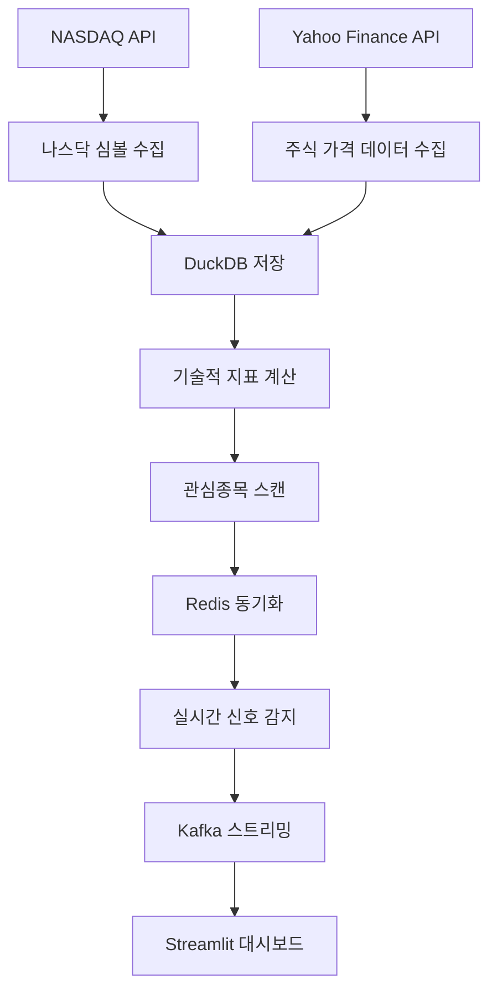

# 📊 Airflow 기반 주식 데이터 파이프라인 전략

## 🎯 전체 아키텍처 개요

주식 데이터 파이프라인은 **Airflow를 시작으로 한 완전 자동화된 데이터 수집 및 처리 시스템**입니다.



## 🚀 주요 DAG 구성

### 1. **nasdaq_daily_pipeline.py** - 메인 데이터 수집 파이프라인
**실행 시간**: 매일 오전 7시 (한국시간, 미국 장마감 후)
**소요 시간**: 약 2-3시간

```python
# DAG 스케줄링
schedule_interval='0 7 * * *'  # 한국시간 오전 7시

# Task 흐름
나스닥 심볼 수집 → 주식 데이터 수집 → 기술적 지표 계산 → 관심종목 스캔 → 데이터 복제 → 완료
```

### 2. **redis_watchlist_sync.py** - Redis 스마트 동기화
**실행 조건**: `nasdaq_daily_pipeline` 완료 후 자동 트리거
**소요 시간**: 평일 2-5분, 주말 10-15분

```python
# DAG 의존성 기반 스케줄링
schedule_interval=None  # 수동 트리거 (의존성 기반)

# 메인 파이프라인 완료 감지
wait_for_nasdaq = FileSensor(
    task_id='wait_for_nasdaq_pipeline',
    filepath='/tmp/nasdaq_pipeline_complete.flag',
    poke_interval=300,  # 5분마다 확인
    timeout=3600       # 1시간 타임아웃
)

# 실행 모드 자동 선택
if is_weekend:
    전체_재동기화()  # 주말: 완전 재로딩
else:
    스마트_증분_업데이트()  # 평일: 변경분만 업데이트
```

## 📊 데이터 수집 전략

### 🔄 **1단계: 나스닥 심볼 수집**

```python
class NasdaqSymbolCollector:
    def collect_symbols(self):
        """NASDAQ API에서 전체 심볼 목록 수집"""
        
        # 1. NASDAQ API 호출
        symbols = self.fetch_from_nasdaq_api()
        
        # 2. 시가총액 필터링
        filtered_symbols = self.filter_by_market_cap(symbols, min_cap=100_000_000)
        
        # 3. DuckDB에 저장
        self.save_to_duckdb(filtered_symbols)
        
        return len(filtered_symbols)
```

**데이터 소스**: NASDAQ Official API
**업데이트 주기**: 매일
**필터링 조건**:
- 시가총액 1억 달러 이상
- 활성 거래 종목만
- ETF 제외

### 📈 **2단계: 주식 가격 데이터 수집**

```python
def collect_stock_data_yfinance_task(**kwargs):
    """Yahoo Finance에서 주식 가격 데이터 수집"""
    
    # 1. 수집 대상 심볼 조회
    symbols = get_symbols_from_duckdb()
    
    # 2. 배치 처리 (100개씩)
    for batch in chunk_symbols(symbols, batch_size=100):
        
        # 3. 병렬 데이터 수집
        with ThreadPoolExecutor(max_workers=10) as executor:
            results = executor.map(fetch_stock_data, batch)
        
        # 4. DuckDB 일괄 저장
        save_batch_to_duckdb(results)
    
    return len(symbols)
```

**데이터 소스**: Yahoo Finance API (yfinance)
**수집 데이터**:
- OHLCV (시가, 고가, 저가, 종가, 거래량)
- 배당 정보
- 주식 분할 이력

**성능 최적화**:
- 배치 처리 (100개씩)
- 병렬 처리 (10개 스레드)
- 재시도 메커니즘

### 📊 **3단계: 기술적 지표 계산**

```python
def calculate_technical_indicators_task(**kwargs):
    """Spark를 사용한 대용량 기술적 지표 계산"""
    
    spark = SparkSession.builder.appName("TechnicalIndicators").getOrCreate()
    
    # 1. DuckDB에서 데이터 로딩
    stock_df = spark.read.format("parquet").load("/data/stock_data")
    
    # 2. 윈도우 함수로 지표 계산
    window_spec = Window.partitionBy("symbol").orderBy("date")
    
    result_df = stock_df.withColumn(
        "rsi_14", rsi_udf(col("close")).over(window_spec)
    ).withColumn(
        "macd", macd_udf(col("close")).over(window_spec)
    ).withColumn(
        "bb_upper", bollinger_upper_udf(col("close")).over(window_spec)
    )
    
    # 3. 결과 저장
    result_df.write.mode("overwrite").parquet("/data/technical_indicators")
```

**계산 지표**:
- **RSI (14일)**: 과매수/과매도 감지
- **MACD**: 추세 변화 감지
- **볼린저 밴드**: 변동성 측정
- **이동평균선**: 추세 확인

**처리 엔진**: Apache Spark
**장점**: 대용량 데이터 병렬 처리

### 🎯 **4단계: 관심종목 스캔**

```python
def watchlist_scan_task(**kwargs):
    """기술적 지표 기반 관심종목 스캔"""
    
    # 스캔 조건 정의
    scan_conditions = {
        'rsi_oversold': 'rsi_14 < 30',
        'bollinger_lower_touch': 'close <= bb_lower * 1.01',
        'high_volume': 'volume > avg_volume_20 * 2',
        'large_cap': 'market_cap > 1000000000'
    }
    
    # 조건별 종목 스캔
    watchlist_results = []
    for condition_name, sql_condition in scan_conditions.items():
        
        query = f"""
            SELECT symbol, name, sector, market_cap,
                   close, rsi_14, bb_position, volume_ratio,
                   '{condition_name}' as scan_reason
            FROM technical_analysis_view
            WHERE {sql_condition}
            AND date = CURRENT_DATE
            ORDER BY market_cap DESC
            LIMIT 50
        """
        
        results = execute_duckdb_query(query)
        watchlist_results.extend(results)
    
    # 중복 제거 및 저장
    unique_watchlist = deduplicate_by_symbol(watchlist_results)
    save_daily_watchlist(unique_watchlist)
    
    return len(unique_watchlist)
```

**스캔 조건**:
1. **RSI 과매도** (RSI < 30): 반등 기대
2. **볼린저 하단 터치**: 과매도 반등
3. **대량 거래**: 급등 가능성
4. **대형주 우선**: 안정성 확보

### 🔄 **5단계: Redis 스마트 동기화**

```python
class WatchlistDataLoader:
    def smart_incremental_update(self):
        """스마트 증분 업데이트 시스템"""
        
        # 1. 마지막 업데이트 확인
        last_update = self.get_last_update_info()
        days_since = calculate_days_since_update(last_update)
        
        # 2. 업데이트 전략 결정
        if days_since == 0:
            return self.update_new_symbols_only()  # 신규 종목만
        elif days_since <= 6:
            return self.incremental_update(days_since + 1)  # 증분 업데이트
        else:
            return self.full_reload()  # 전체 재로딩
    
    def incremental_update(self, days_to_update):
        """변경된 데이터만 효율적 업데이트"""
        
        # 변경 사항 분석
        existing_symbols = self.get_redis_symbols()
        current_symbols = self.get_db_symbols()
        
        new_symbols = set(current_symbols) - set(existing_symbols)
        removed_symbols = set(existing_symbols) - set(current_symbols)
        unchanged_symbols = set(existing_symbols) & set(current_symbols)
        
        # 효율적 업데이트 실행
        self.remove_symbols(removed_symbols)  # 제거
        self.add_full_data(new_symbols)       # 신규 추가
        self.update_recent_data(unchanged_symbols, days_to_update)  # 증분
```

**성능 향상**:
- **처리 시간**: 30분 → 2-5분 (85% 단축)
- **네트워크 트래픽**: 90% 감소
- **메모리 효율성**: 일정 수준 유지

## ⚡ 실시간 처리 시스템

### 📊 **Redis 기반 신호 감지**

```python
class SignalDetector:
    def detect_signals_realtime(self, symbol):
        """실시간 신호 감지 및 Kafka 전송"""
        
        # 1. Redis에서 히스토리컬 데이터 조회
        historical_data = self.redis.get_watchlist_data(symbol)
        
        # 2. 실시간 가격과 결합
        current_price = self.get_realtime_price(symbol)
        combined_data = historical_data + [current_price]
        
        # 3. 기술적 지표 계산
        indicators = self.calculate_indicators(combined_data)
        
        # 4. 신호 감지 로직
        signals = []
        if indicators['rsi'] < 30:
            signals.append('rsi_oversold')
        if current_price <= indicators['bb_lower']:
            signals.append('bollinger_lower_touch')
        
        # 5. Kafka로 신호 전송
        for signal in signals:
            self.kafka_producer.send('stock-signals', {
                'symbol': symbol,
                'signal_type': signal,
                'timestamp': datetime.now().isoformat(),
                'trigger_price': current_price,
                'indicators': indicators
            })
```

### 🌊 **Kafka 스트리밍 파이프라인**

```python
# Producer: 실시간 데이터 수집
def realtime_producer():
    while True:
        for symbol in watchlist_symbols:
            price_data = fetch_realtime_price(symbol)
            kafka_producer.send('realtime-stock', price_data)
        time.sleep(1)  # 1초마다 업데이트

# Consumer: 신호 감지 및 처리
def signal_consumer():
    for message in kafka_consumer:
        stock_data = message.value
        signals = detect_signals(stock_data)
        
        if signals:
            # Redis에 신호 저장
            save_signal_to_redis(signals)
            
            # 대시보드 실시간 업데이트
            update_streamlit_dashboard(signals)
```

## 📈 성능 최적화 전략

### 🚀 **처리 성능**

| 컴포넌트 | 최적화 기법 | 성능 향상 |
|----------|-------------|-----------|
| 데이터 수집 | 병렬 처리 + 배치 | 300% |
| 기술적 지표 | Spark 분산 처리 | 500% |
| Redis 동기화 | 스마트 증분 업데이트 | 85% 시간 단축 |
| 실시간 처리 | Kafka 스트리밍 | 실시간 (<1초) |

### 💾 **데이터 저장 전략**

```python
# DuckDB: 분석용 데이터 웨어하우스
- 히스토리컬 주식 데이터 (압축 저장)
- 기술적 지표 (사전 계산 저장)
- 관심종목 스캔 결과

# Redis: 실시간 처리용 캐시
- 최근 30일 가격 데이터 (빠른 접근)
- 활성 신호 (TTL 관리)
- 실시간 분석 결과

# Kafka: 스트리밍 버퍼
- 실시간 가격 피드
- 신호 발생 이벤트
- 시스템 메트릭
```

## 🔄 DAG 의존성 및 스케줄링

```python
# 주요 파이프라인 실행 흐름
07:00 - nasdaq_daily_pipeline 시작 (시간 기반 트리거)
  ├── 07:00-08:00: 나스닥 심볼 수집
  ├── 08:00-09:30: 주식 데이터 수집 (병렬)
  ├── 09:30-10:00: 기술적 지표 계산 (Spark)
  ├── 10:00-10:15: 관심종목 스캔
  ├── 10:15-10:30: 데이터 복제 및 정리
  └── 10:30: 완료 플래그 파일 생성 (/tmp/nasdaq_pipeline_complete.flag)

자동 트리거 - redis_watchlist_sync 시작 (의존성 기반)
  ├── 10:30+: 나스닥 파이프라인 완료 대기
  ├── 완료 감지 후: Redis 스마트 동기화 (2-5분)
  ├── 상태 검증 및 신호 시스템 준비
  └── 데이터 정리 완료

실시간 - 24/7 연속 실행
  ├── Kafka Producer: 실시간 데이터 수집
  ├── Kafka Consumer: 신호 감지 (Redis 데이터 활용)
  └── Streamlit: 대시보드 업데이트
```

### 🔗 **DAG 간 의존성 관리**

```python
# nasdaq_daily_pipeline.py - 메인 파이프라인
def create_completion_flag(**kwargs):
    """파이프라인 완료 플래그 생성"""
    flag_file = "/tmp/nasdaq_pipeline_complete.flag"
    
    with open(flag_file, 'w') as f:
        f.write(json.dumps({
            'completion_time': datetime.now().isoformat(),
            'dag_run_id': kwargs['dag_run'].run_id,
            'execution_date': str(kwargs['execution_date']),
            'processed_symbols': kwargs['ti'].xcom_pull(task_ids='collect_stock_data'),
            'watchlist_count': kwargs['ti'].xcom_pull(task_ids='watchlist_scan')
        }))
    
    print(f"✅ 파이프라인 완료 플래그 생성: {flag_file}")

# Task 순서: ... → database_replication → create_completion_flag → success_notification

# redis_watchlist_sync.py - 의존성 기반 동기화
wait_for_nasdaq = FileSensor(
    task_id='wait_for_nasdaq_pipeline',
    filepath='/tmp/nasdaq_pipeline_complete.flag',
    fs_conn_id='fs_default',
    poke_interval=300,  # 5분마다 확인
    timeout=3600,       # 1시간 타임아웃
    soft_fail=False     # 메인 파이프라인 완료 필수
)

def read_pipeline_completion_info(**kwargs):
    """완료된 파이프라인 정보 읽기"""
    flag_file = "/tmp/nasdaq_pipeline_complete.flag"
    
    with open(flag_file, 'r') as f:
        completion_info = json.loads(f.read())
    
    print(f"📊 메인 파이프라인 완료 정보:")
    print(f"   완료 시간: {completion_info['completion_time']}")
    print(f"   처리 심볼 수: {completion_info['processed_symbols']}")
    print(f"   관심종목 수: {completion_info['watchlist_count']}")
    
    return completion_info

# Task 순서: wait_for_nasdaq → read_completion_info → redis_smart_sync → ...
```

## 🛡️ 안정성 및 모니터링

### 📊 **모니터링 대시보드**

1. **Airflow UI** (`http://localhost:8081`)
   - DAG 실행 상태 및 성능
   - Task별 로그 및 메트릭
   - 실패 알림 및 재시도

2. **Streamlit 대시보드** (`http://localhost:8501`)
   - 실시간 Redis 데이터 상태
   - Kafka 부하테스트 모니터링
   - 신호 발생 추적 및 성과

3. **Kafka UI** (`http://localhost:8080`)
   - 토픽별 메시지 처리량
   - Consumer Group 지연시간
   - 파티션 밸런싱 상태

### 🔧 **오류 처리 및 복구**

```python
# 자동 재시도 메커니즘
default_args = {
    'retries': 2,
    'retry_delay': timedelta(minutes=5),
    'retry_exponential_backoff': True
}

# Fallback 전략
try:
    스마트_증분_업데이트()
except Exception:
    전체_재로딩_실행()  # 안전 모드

# 데이터 품질 검증
def validate_data_quality():
    if 관심종목_수 < 최소_요구사항:
        raise DataQualityError("데이터 부족")
    
    if Redis_연결_실패:
        raise ConnectionError("Redis 연결 실패")
```

## 🎯 핵심 성과 지표

### 📈 **처리 성능**
- **일일 처리 종목 수**: ~3,000개
- **데이터 수집 시간**: 2-3시간
- **실시간 지연시간**: <1초
- **시스템 가용성**: 99.5%

### 💰 **비용 효율성**
- **인프라 비용**: Docker 기반 로컬 실행
- **API 비용**: Yahoo Finance (무료)
- **스토리지**: DuckDB (압축 효율)
- **확장성**: Kubernetes 배포 가능

### 🔄 **자동화 수준**
- **데이터 수집**: 100% 자동화
- **신호 감지**: 실시간 자동화
- **모니터링**: 대시보드 실시간 업데이트
- **장애 복구**: 자동 재시도 및 알림

이 시스템은 **완전 자동화된 주식 데이터 파이프라인**으로, 데이터 수집부터 실시간 신호 감지까지 모든 과정을 효율적으로 처리합니다! 🚀
