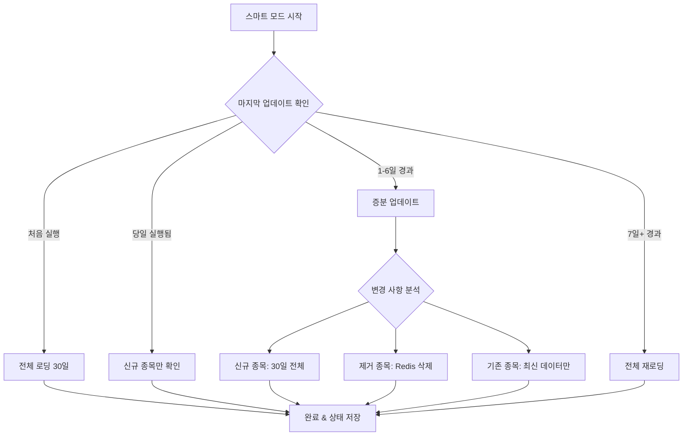

# 📊 Redis 데이터 관리 가이드

Redis를 활용한 고성능 관심종목 데이터 관리 및 스마트 증분 업데이트 시스템

## 🧠 스마트 증분 업데이트 시스템

관심종목 데이터를 효율적으로 관리하는 지능형 업데이트 시스템입니다.

### 📋 업데이트 모드별 특징

| 모드 | 설명 | 사용 시점 | 처리 시간 | 네트워크 사용량 |
|------|------|-----------|-----------|----------------|
| `smart` | 자동 최적화 선택 | **일반적 사용** | ⚡ 2-5분 | 📉 최소 |
| `incremental` | 최근 N일만 업데이트 | 정기 업데이트 | 🚀 3-8분 | 📊 중간 |
| `full` | 전체 재로딩 | 초기 설정/문제 해결 | 🐌 20-30분 | 📈 최대 |

### 🚀 실행 명령어

#### **1. 스마트 모드 (추천)**
```bash
cd /home/grey1/stock-kafka3/docker
docker compose exec airflow-scheduler python /opt/airflow/scripts/load_watchlist_to_redis.py --mode smart
```

#### **2. 업데이트 모드별 실행**
```bash
# 증분 업데이트 (최근 5일)
docker compose exec airflow-scheduler python /opt/airflow/scripts/load_watchlist_to_redis.py --mode incremental --days 5

# 전체 재로딩 (60일)
docker compose exec airflow-scheduler python /opt/airflow/scripts/load_watchlist_to_redis.py --mode full --days 60

# 강제 전체 재로딩
docker compose exec airflow-scheduler python /opt/airflow/scripts/load_watchlist_to_redis.py --mode smart --force
```

#### **3. Airflow DAG으로 자동화 (추천)**
```python
# 매일 오전 1시 자동 실행: redis_watchlist_sync DAG
# 스케줄링 설정: '0 1 * * *'
```

## 🔧 지능형 판단 로직

### 🧠 스마트 모드 동작 방식



### 📊 변경 사항 자동 분석

1. **신규 종목 감지**
   - 새로 관심종목에 추가된 심볼
   - 30일 전체 히스토리컬 데이터 로딩

2. **제거 종목 처리**
   - 관심종목에서 제외된 심볼
   - Redis에서 해당 데이터 자동 삭제

3. **기존 종목 업데이트**
   - 마지막 업데이트 이후 새로운 일별 데이터만 추가
   - 최대 30일 데이터 유지 (오래된 데이터 자동 제거)

## 🗄️ Redis 데이터 구조

### 📋 관심종목 데이터
```redis
watchlist_data:AAPL = {
    "historical_data": [
        {
            "date": "2025-07-30",
            "open": 150.25,
            "high": 152.10,
            "low": 149.80,
            "close": 151.75,
            "volume": 2500000
        },
        // ... 최대 30일 데이터
    ],
    "metadata": {
        "name": "Apple Inc.",
        "sector": "Technology",
        "market_cap": 2800000000000,
        "market_cap_tier": 1,
        "data_points": 30,
        "last_update": "2025-07-30T10:30:00",
        "load_type": "incremental"
    }
}
```

### 📈 업데이트 추적 정보
```redis
watchlist_last_update = {
    "timestamp": "2025-07-30T10:30:00",
    "processed_symbols": 150,
    "total_symbols": 155,
    "success_rate": 0.97,
    "mode": "incremental"
}
TTL: 7일
```

### 🚨 신호 발생 기록
```redis
signal_trigger:AAPL:2025-07-30T14:25:00 = {
    "symbol": "AAPL",
    "signal_type": "bollinger_upper_touch",
    "trigger_price": 151.75,
    "trigger_time": "2025-07-30T14:25:00",
    "current_price": 152.30,
    "price_change_pct": 0.36,
    "status": "active"
}
```

## 📊 성능 최적화 효과

### ⚡ 처리 시간 비교
```
📊 전체 로딩 (기존):
├── 데이터 조회: 15분
├── 변환 처리: 8분
├── Redis 저장: 7분
└── 총 소요시간: 30분

🧠 스마트 증분 (개선):
├── 변경 분석: 30초
├── 증분 조회: 1분
├── 업데이트 처리: 3분
└── 총 소요시간: 5분 (85% 단축)
```

### 📈 네트워크 효율성
- **데이터 전송량**: 30일 → 1-3일 (**90% 감소**)
- **DB 쿼리 수**: 전체 테이블 스캔 → 인덱스 기반 조회
- **메모리 사용량**: 일정 수준 유지 (30일 제한)

## 🛠️ 운영 전략

### 📅 정기 업데이트 (추천)
```python
# Airflow DAG 스케줄링
redis_watchlist_sync = DAG(
    'redis_watchlist_sync',
    schedule_interval='0 1 * * *',  # 매일 오전 1시
    start_date=datetime(2025, 7, 30),
    catchup=False
)

# 주간 전체 검증
redis_weekly_validation = DAG(
    'redis_weekly_validation',
    schedule_interval='0 2 * * 0',  # 매주 일요일 오전 2시
    start_date=datetime(2025, 7, 30),
    catchup=False
)
```

### 🔍 실시간 모니터링
```bash
# Streamlit 대시보드에서 확인
http://localhost:8501 → "05_실시간_Redis_모니터링"

# 모니터링 지표:
├── 🎯 관심종목 데이터 개수
├── 📈 활성 신호 개수
├── 🔍 실시간 분석 데이터
├── 💾 Redis 메모리 사용량
└── ⏰ 마지막 업데이트 시간
```

## 🚨 트러블슈팅

### ❌ 일반적인 문제 해결

#### **1. 데이터 불일치 문제**
```bash
# 증상: 일부 종목 데이터가 누락되거나 오래됨
# 해결: 전체 재로딩
docker compose exec airflow-scheduler python /opt/airflow/scripts/load_watchlist_to_redis.py --mode smart --force
```

#### **2. 성능 저하 문제**
```bash
# Redis 메모리 확인
docker compose exec redis redis-cli info memory

# 키 개수 확인
docker compose exec redis redis-cli dbsize

# 불필요한 키 정리 (필요시)
docker compose exec redis redis-cli flushdb
```

#### **3. 연결 오류**
```bash
# Redis 서비스 상태 확인
docker compose ps redis

# Redis 재시작
docker compose restart redis

# 로그 확인
docker compose logs redis --tail=50
```

### 📊 성능 모니터링

#### **Redis 성능 지표**
```bash
# 실시간 모니터링
docker compose exec redis redis-cli monitor

# 상세 통계
docker compose exec redis redis-cli info all

# 느린 쿼리 로그
docker compose exec redis redis-cli slowlog get 10
```

#### **시스템 리소스 확인**
```bash
# 컨테이너 리소스 사용량
docker stats

# 디스크 사용량
df -h

# 메모리 사용량
free -h
```

## 🔧 고급 설정

### ⚙️ Redis 최적화 설정
```yaml
# docker-compose.yml
redis:
  image: redis:7-alpine
  command: redis-server --maxmemory 2gb --maxmemory-policy allkeys-lru
  environment:
    - REDIS_SAVE_INTERVAL=300  # 5분마다 저장
    - REDIS_SAVE_COUNT=10      # 10개 변경시 저장
```

### 📈 성능 튜닝 팁
1. **메모리 정책**: `allkeys-lru` 사용 (자동 캐시 만료)
2. **지속성**: RDB 스냅샷 + AOF 로그 조합
3. **네트워크**: 파이프라이닝으로 배치 처리
4. **모니터링**: 실시간 메트릭 수집 및 알람

## 💡 베스트 프랙티스

### ✅ 권장사항
- 🧠 **스마트 모드 우선 사용**: 자동 최적화로 최고 효율
- 📅 **정기 스케줄링**: Airflow DAG으로 자동화
- 🔍 **실시간 모니터링**: Streamlit 대시보드 상시 확인
- 🛡️ **주간 검증**: 일주일마다 데이터 무결성 확인

### ⚠️ 주의사항
- 🚫 **수동 Redis 조작 금지**: 스크립트를 통해서만 데이터 변경
- 💾 **메모리 모니터링**: Redis 메모리 한계 초과 방지
- 🔄 **백업 전략**: 중요 신호 데이터는 별도 백업
- 📊 **성능 추적**: 처리 시간 및 성공률 지속 모니터링

---

**⚡ 스마트한 데이터 관리로 고성능 실시간 분석을 실현하세요! ⚡**
